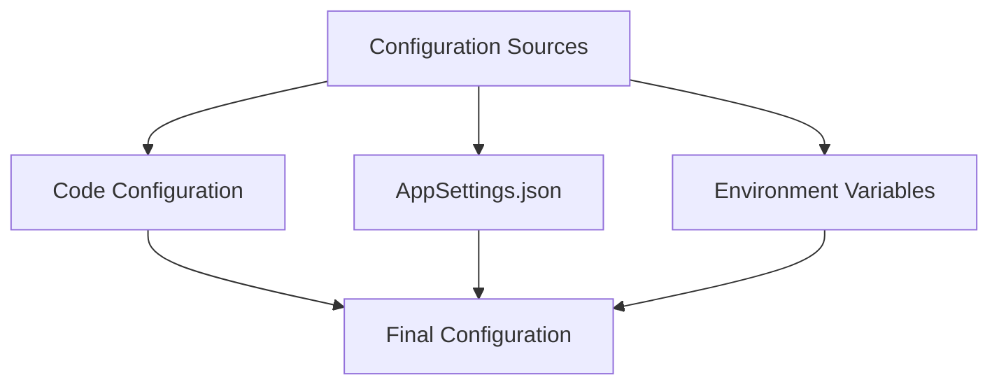
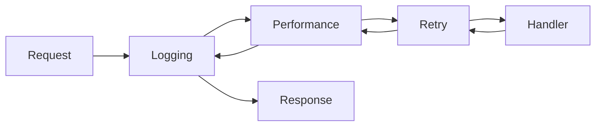
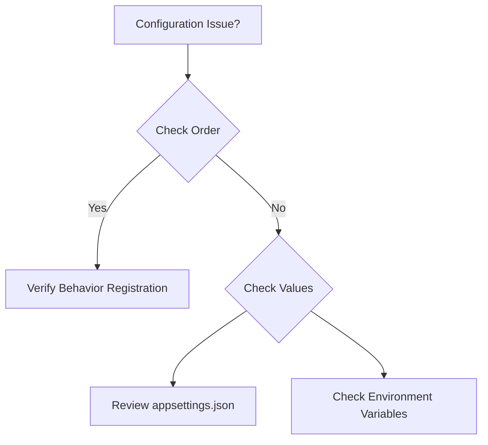

# FS.Mediator Configuration Guide

## Configuration Overview

FS.Mediator provides flexible configuration options through:



## Basic Configuration

### 1. Minimal Setup

```csharp
// Program.cs
var builder = WebApplication.CreateBuilder(args);

builder.Services.AddFSMediator();  // Default configuration

var app = builder.Build();
app.Run();
```

### 2. Common Configuration Options

```csharp
builder.Services.AddFSMediator(options => 
{
    options.EnableRequestLogging = true;
    options.DefaultTimeout = TimeSpan.FromSeconds(30);
    options.EnableDiagnostics = true;
});
```

## Behavior Configuration

### Built-in Behaviors



```csharp
// Configure behaviors with presets
builder.Services
    .AddFSMediator()
    .AddLoggingBehavior()
    .AddPerformanceBehavior()
    .AddRetryBehavior(RetryPreset.Database);
```

### Custom Behavior Order

```csharp
// Custom behavior pipeline
builder.Services
    .AddFSMediator()
    .AddBehavior<CustomBehavior1>()  // First
    .AddBehavior<CustomBehavior2>()  // Second
    .AddBehavior<CustomBehavior3>(); // Third
```

## Advanced Configuration

### Environment-based Setup

```csharp
if (builder.Environment.IsDevelopment())
{
    builder.Services.AddFSMediator(devOptions);
}
else
{
    builder.Services.AddFSMediator(prodOptions);
}
```

### Configuration via appsettings.json

```json
{
  "FSMediator": {
    "DefaultTimeout": "00:00:30",
    "EnableDiagnostics": true,
    "Behaviors": {
      "Logging": {
        "LogLevel": "Information"
      },
      "Retry": {
        "MaxAttempts": 3
      }
    }
  }
}
```

## Configuration Reference

| Option | Type | Default | Description |
|--------|------|---------|-------------|
| DefaultTimeout | TimeSpan | 30s | Default request timeout |
| EnableRequestLogging | bool | true | Enable automatic request logging |
| EnableDiagnostics | bool | false | Enable diagnostic endpoints |
| BehaviorTimeout | TimeSpan | 5s | Maximum behavior execution time |

## Troubleshooting

### Common Issues

1. **Behaviors not executing**: Verify registration order
2. **Configuration not applied**: Check environment overrides
3. **Timeout issues**: Adjust DefaultTimeout value



## Next Steps

- [Behavior Configuration](../behaviors.md)
- [Resilience Patterns](../resilience/overview.md)
- [Monitoring Setup](../monitoring/README.md)
- [Streaming Guide](../streaming/getting-started.md)