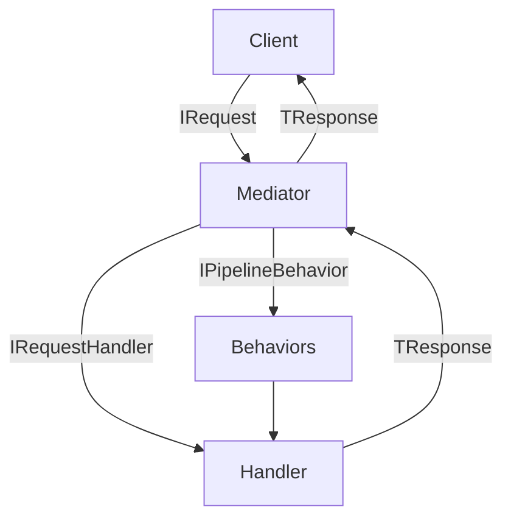
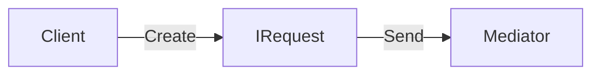
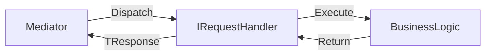
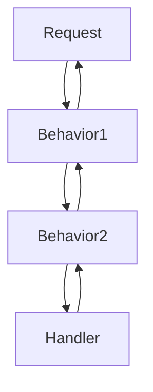
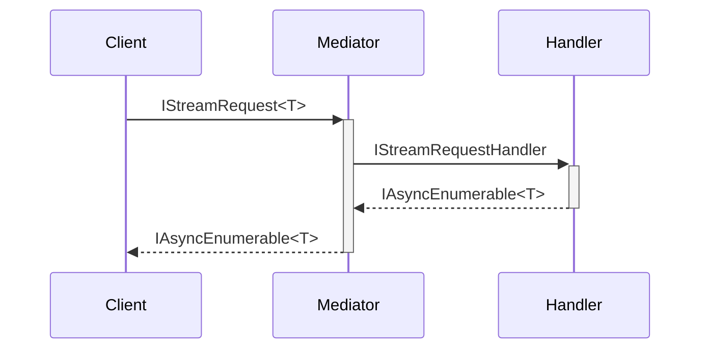
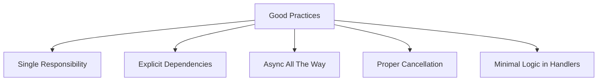

# Core Interfaces Reference

## Interface Architecture Overview



## Fundamental Interfaces

### IRequest<TResponse>
**Purpose**: Base marker interface for all request types



**Key Features**:
- Generic type parameter defines response type
- No required members (pure marker interface)
- Enables strong typing of request/response pairs

**Example**:
```csharp
// Query example
public record GetUserByIdQuery(int UserId) : IRequest<UserDto>;

// Command example
public record CreateUserCommand(string Name, string Email) : IRequest<CreationResult>;

// Response DTO
public record UserDto(int Id, string Name, string Email);
```

### IRequestHandler<TRequest, TResponse>
**Purpose**: Processes specific request types



**Implementation Guide**:
1. One handler per request type
2. Should contain minimal logic
3. Coordinate domain services

**Full Example**:
```csharp
public class GetUserHandler : IRequestHandler<GetUserByIdQuery, UserDto>
{
    private readonly IUserRepository _repository;
    
    public GetUserHandler(IUserRepository repository)
    {
        _repository = repository;
    }

    public async Task<UserDto> HandleAsync(
        GetUserByIdQuery query, 
        CancellationToken ct)
    {
        var user = await _repository.GetByIdAsync(query.UserId, ct);
        return new UserDto(user);
    }
}
```

## Pipeline Interfaces

### IPipelineBehavior<TRequest, TResponse>
**Purpose**: Middleware for cross-cutting concerns



**Common Use Cases**:
1. Logging
2. Validation
3. Retry mechanisms
4. Performance monitoring

**Advanced Example**:
```csharp
public class ValidationBehavior<TRequest, TResponse> 
    : IPipelineBehavior<TRequest, TResponse>
    where TRequest : notnull
{
    private readonly IValidator<TRequest> _validator;

    public ValidationBehavior(IValidator<TRequest> validator)
    {
        _validator = validator;
    }

    public async Task<TResponse> HandleAsync(
        TRequest request,
        RequestHandlerDelegate<TResponse> next,
        CancellationToken ct)
    {
        var results = await _validator.ValidateAsync(request, ct);
        if (!results.IsValid)
        {
            throw new ValidationException(results.Errors);
        }
        
        return await next();
    }
}
```

## Specialized Interfaces

### Streaming Interfaces


**Streaming Example**:
```csharp
public record UserSearchQuery(string SearchTerm) : IStreamRequest<UserDto>;

public class UserSearchHandler : IStreamRequestHandler<UserSearchQuery, UserDto>
{
    public async IAsyncEnumerable<UserDto> HandleAsync(
        UserSearchQuery query,
        [EnumeratorCancellation] CancellationToken ct)
    {
        await foreach (var user in _repository.SearchAsync(query.SearchTerm, ct))
        {
            yield return new UserDto(user);
        }
    }
}
```

## Best Practices



1. **Handler Design**:
   - Thin handlers (delegate to domain services)
   - Pure functions when possible
   - Avoid business logic in behaviors

2. **Performance Considerations**:
   - Avoid expensive operations in behaviors
   - Use ValueTask for hot paths
   - Consider handler pooling for high throughput

## Next Steps
- [Behavior Configuration](behaviors.md)
- [Streaming Guide](streaming.md)
- [Configuration Reference](configuration.md)