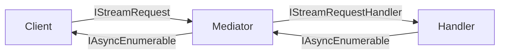
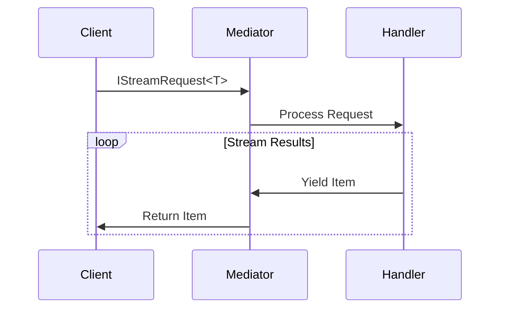

# Streaming API Reference

## Core Concepts



### Key Interfaces
1. **IStreamRequest<TResponse>**
```csharp
public record UserSearchQuery(string Term) : IStreamRequest<UserDto>;
```

2. **IStreamRequestHandler<TRequest, TResponse>**
```csharp
public class UserSearchHandler : IStreamRequestHandler<UserSearchQuery, UserDto>
{
    public async IAsyncEnumerable<UserDto> HandleAsync(
        UserSearchQuery query,
        [EnumeratorCancellation] CancellationToken ct)
    {
        await foreach (var user in _repository.SearchAsync(query.Term, ct))
        {
            yield return new UserDto(user);
        }
    }
}
```

## Streaming Pipeline



### Built-in Behaviors
1. **Backpressure Management**
2. **Resource Monitoring**
3. **Circuit Breaking**
4. **Performance Tracking**

## Best Practices
- Use `[EnumeratorCancellation]` parameter
- Implement proper error handling
- Consider backpressure strategies
- Monitor resource usage

## Related Documentation
- [Core Interfaces](core-interfaces.md)
- [Configuration](configuration.md)
- [Behaviors](behaviors.md)