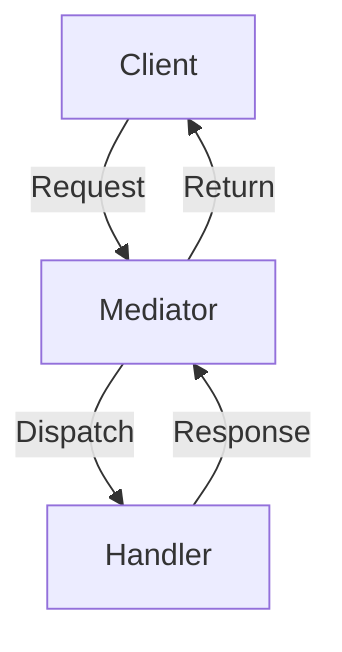
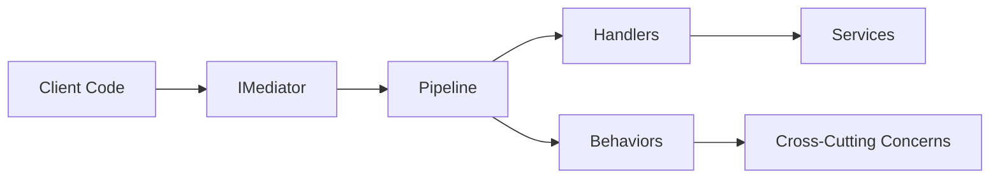

# FS.Mediator Core Concepts



## Fundamental Components

### 1. Mediator Pattern
- **Decouples** requesters from executors
- Centralized **request routing**
- Built-in **pipeline behaviors**

### 2. Key Interfaces
```csharp
// Request/Response
public interface IRequest<TResponse>
public interface IRequestHandler<TRequest, TResponse>

// Streaming
public interface IStreamRequest<TResponse>
public interface IStreamRequestHandler<TRequest, TResponse>
```

## Architecture Overview



## Core Features

| Feature | Description | Benefit |
|---------|-------------|---------|
| Request/Response | Synchronous message handling | Simple workflows |
| Streaming | Async sequence processing | Real-time data |
| Behaviors | Pipeline middleware | Cross-cutting concerns |
| DI Integration | Native IoC support | Clean architecture |

## Getting Started

### 1. Basic Request
```csharp
public record GetUserQuery(int Id) : IRequest<User>;

public class GetUserHandler : IRequestHandler<GetUserQuery, User>
{
    public Task<User> Handle(GetUserQuery request, CancellationToken ct)
    {
        return _repository.GetUserAsync(request.Id, ct);
    }
}
```

### 2. Service Registration
```csharp
services.AddFSMediator(cfg => 
{
    cfg.RegisterHandlersFromAssemblyContaining<Startup>();
});
```

## Next Steps

- Learn About Streaming
- [Understand Behaviors](/configuration/behaviors.md)