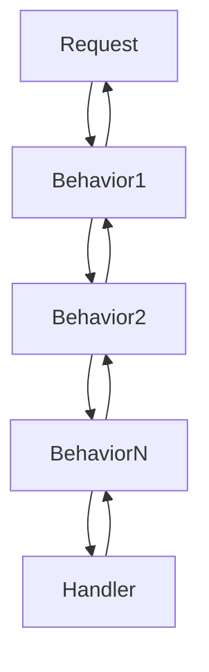
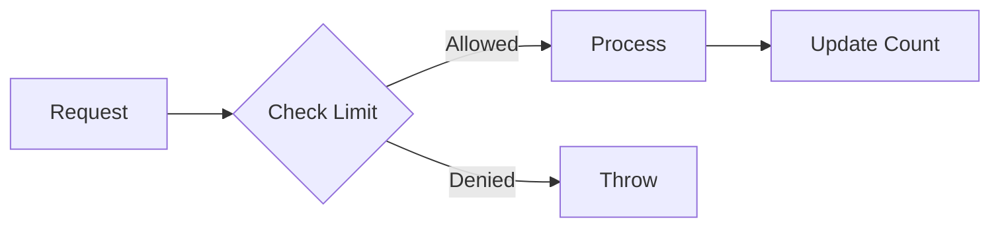

# Custom Behavior Development Guide

## Behavior Architecture



## Core Interfaces

### Standard Behaviors
```csharp
public interface IPipelineBehavior<TRequest, TResponse>
    where TRequest : notnull
{
    Task<TResponse> HandleAsync(
        TRequest request,
        RequestHandlerDelegate<TResponse> next,
        CancellationToken cancellationToken);
}
```

### Streaming Behaviors
```csharp
public interface IStreamPipelineBehavior<TRequest, TResponse>
    where TRequest : IStreamRequest<TResponse>
{
    IAsyncEnumerable<TResponse> HandleAsync(
        TRequest request,
        StreamRequestHandlerDelegate<TResponse> next,
        CancellationToken cancellationToken);
}
```

## Creating Custom Behaviors

### Basic Example: Logging Behavior
```csharp
public class LoggingBehavior<TRequest, TResponse> 
    : IPipelineBehavior<TRequest, TResponse>
    where TRequest : notnull
{
    private readonly ILogger<LoggingBehavior<TRequest, TResponse>> _logger;

    public LoggingBehavior(ILogger<LoggingBehavior<TRequest, TResponse>> logger)
    {
        _logger = logger;
    }

    public async Task<TResponse> HandleAsync(
        TRequest request,
        RequestHandlerDelegate<TResponse> next,
        CancellationToken ct)
    {
        _logger.LogInformation("Handling {RequestType}", typeof(TRequest).Name);
        
        var stopwatch = Stopwatch.StartNew();
        try
        {
            var response = await next();
            stopwatch.Stop();
            
            _logger.LogInformation("Completed {RequestType} in {ElapsedMs}ms", 
                typeof(TRequest).Name, stopwatch.ElapsedMilliseconds);
            
            return response;
        }
        catch (Exception ex)
        {
            stopwatch.Stop();
            _logger.LogError(ex, "Error handling {RequestType} after {ElapsedMs}ms",
                typeof(TRequest).Name, stopwatch.ElapsedMilliseconds);
            throw;
        }
    }
}
```

### Advanced Example: Rate Limiting Behavior


```csharp
public class RateLimitingBehavior<TRequest, TResponse> 
    : IPipelineBehavior<TRequest, TResponse>
    where TRequest : notnull
{
    private readonly RateLimiter _limiter;
    
    public RateLimitingBehavior(RateLimiter limiter)
    {
        _limiter = limiter;
    }

    public async Task<TResponse> HandleAsync(
        TRequest request,
        RequestHandlerDelegate<TResponse> next,
        CancellationToken ct)
    {
        if (!_limiter.TryAcquire())
        {
            throw new RateLimitExceededException();
        }
        
        return await next();
    }
}
```

## Behavior Registration

### Standard Registration
```csharp
services.AddMediator(cfg =>
{
    cfg.AddBehavior<LoggingBehavior<,>>();
    cfg.AddBehavior<RateLimitingBehavior<,>>();
});
```

### Conditional Registration
```csharp
services.AddMediator(cfg =>
{
    cfg.AddBehavior<,>(provider => 
    {
        var env = provider.GetRequiredService<IWebHostEnvironment>();
        return env.IsDevelopment() 
            ? new DevelopmentBehavior<,>() 
            : new ProductionBehavior<,>();
    });
});
```

## Best Practices
1. **Single Responsibility**: Each behavior should handle one concern
2. **Stateless Design**: Avoid storing request-specific state
3. **Proper Error Handling**: Clean up resources in finally blocks
4. **Performance Awareness**: Minimize synchronous work

## Related Documentation
- [Core Interfaces](../api-reference/core-interfaces.md)
- [Behavior Configuration](behaviors.md)
- [Streaming Guide](../api-reference/streaming.md)