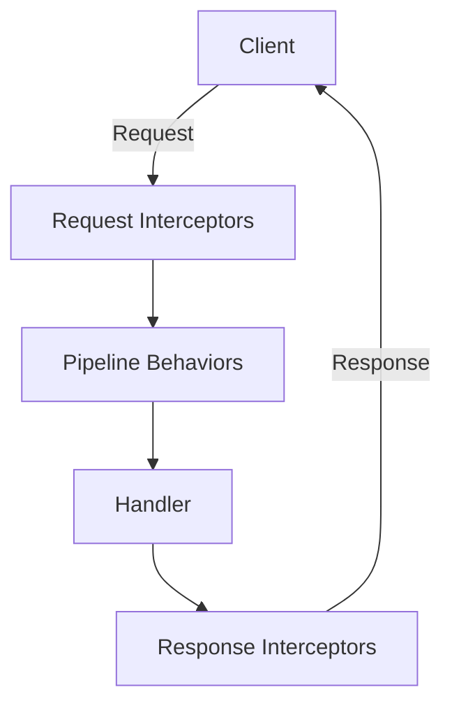

# Interceptors Guide

## Interceptor Architecture



## Core Interfaces

### Request Interceptors
```csharp
public interface IRequestInterceptor<TRequest, TResponse>
    where TRequest : IRequest<TResponse>
{
    Task<TRequest> InterceptRequestAsync(TRequest request, CancellationToken ct);
}
```

### Response Interceptors
```csharp
public interface IResponseInterceptor<TRequest, TResponse>
    where TRequest : IRequest<TResponse>
{
    Task<TResponse> InterceptResponseAsync(TRequest request, TResponse response, CancellationToken ct);
}
```

## Creating Interceptors

### Request Validation Example
```csharp
public class ValidationInterceptor<TRequest, TResponse> 
    : IRequestInterceptor<TRequest, TResponse>
    where TRequest : IRequest<TResponse>
{
    private readonly IValidator<TRequest> _validator;

    public ValidationInterceptor(IValidator<TRequest> validator)
    {
        _validator = validator;
    }

    public async Task<TRequest> InterceptRequestAsync(
        TRequest request, 
        CancellationToken ct)
    {
        var results = await _validator.ValidateAsync(request, ct);
        if (!results.IsValid)
        {
            throw new ValidationException(results.Errors);
        }
        return request;
    }
}
```

### Response Transformation Example


```csharp
public class EnrichmentInterceptor<TRequest, TResponse> 
    : IResponseInterceptor<TRequest, TResponse>
    where TRequest : IRequest<TResponse>
{
    public Task<TResponse> InterceptResponseAsync(
        TRequest request,
        TResponse response,
        CancellationToken ct)
    {
        if (response is IEnrichable enrichable)
        {
            enrichable.Metadata.Add("ProcessedAt", DateTime.UtcNow);
            enrichable.Metadata.Add("CorrelationId", Guid.NewGuid());
        }
        return Task.FromResult(response);
    }
}
```

## Registration

### Standard Registration
```csharp
services.AddMediator(cfg =>
{
    cfg.AddRequestInterceptor<CreateOrderCommand, OrderResult, ValidationInterceptor<CreateOrderCommand, OrderResult>>();
    cfg.AddResponseInterceptor<GetUserQuery, UserDto, EnrichmentInterceptor<GetUserQuery, UserDto>>();
});
```

### Global Interceptors
```csharp
services.AddMediator(cfg =>
{
    cfg.AddGlobalRequestInterceptor<AuditInterceptor>();
    cfg.AddGlobalResponseInterceptor<LoggingInterceptor>();
});
```

## Best Practices
1. **Single Responsibility**: Each interceptor should handle one concern
2. **Idempotency**: Interceptors should be safely repeatable
3. **Performance**: Avoid expensive operations in interceptors
4. **Error Handling**: Cleanly handle and transform errors

## Related Documentation
- [Core Interfaces](../api-reference/core-interfaces.md)
- [Custom Behaviors](custom-behaviors.md)
- [Configuration Reference](configuration.md)