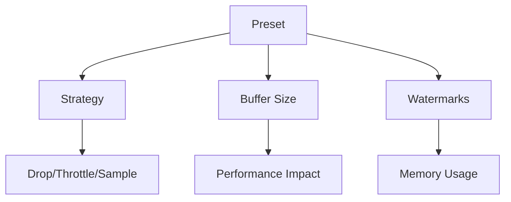
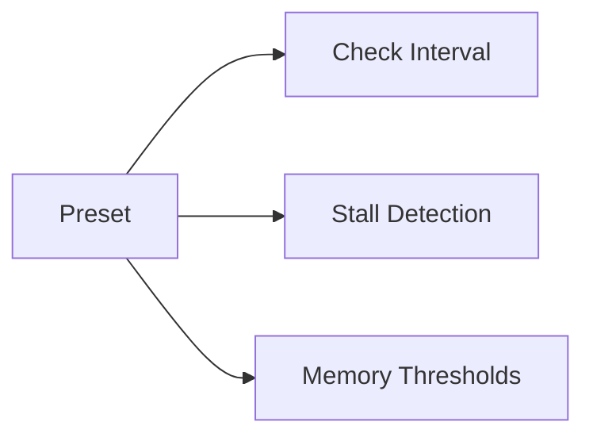

# Configuration Presets Guide

## Backpressure Presets



### Available Presets

#### RealTime
```csharp
services.AddMediator(cfg => {
    cfg.AddStreamingBackpressureBehavior(BackpressurePreset.RealTime);
});
```
- **Strategy**: Throttle with Drop fallback
- **Buffer Size**: 1,000 items
- **Watermarks**: 80%/50%
- **Use Case**: Low-latency streaming (chat, notifications)

#### DataProcessing
```csharp
services.AddMediator(cfg => {
    cfg.AddStreamingBackpressureBehavior(BackpressurePreset.DataProcessing);
});
```
- **Strategy**: Buffer with Sample fallback
- **Buffer Size**: 10,000 items
- **Watermarks**: 90%/60%
- **Use Case**: Batch data processing (ETL, analytics)

## Health Check Presets



### Available Presets

#### HighPerformance
```csharp
services.AddMediator(cfg => {
    cfg.AddStreamingHealthCheckBehavior(HealthCheckPreset.HighPerformance);
});
```
- **Check Interval**: 5 seconds
- **Stall Detection**: 10 seconds
- **Memory Threshold**: 500MB

#### LongRunning
```csharp
services.AddMediator(cfg => {
    cfg.AddStreamingHealthCheckBehavior(HealthCheckPreset.LongRunning);
});
```
- **Check Interval**: 60 seconds
- **Stall Detection**: 5 minutes
- **Memory Threshold**: 2GB

## Related Documentation
- [Streaming Guide](../api-reference/streaming.md)
- [Custom Behaviors](custom-behaviors.md)
- [Interceptor Guide](interceptors.md)