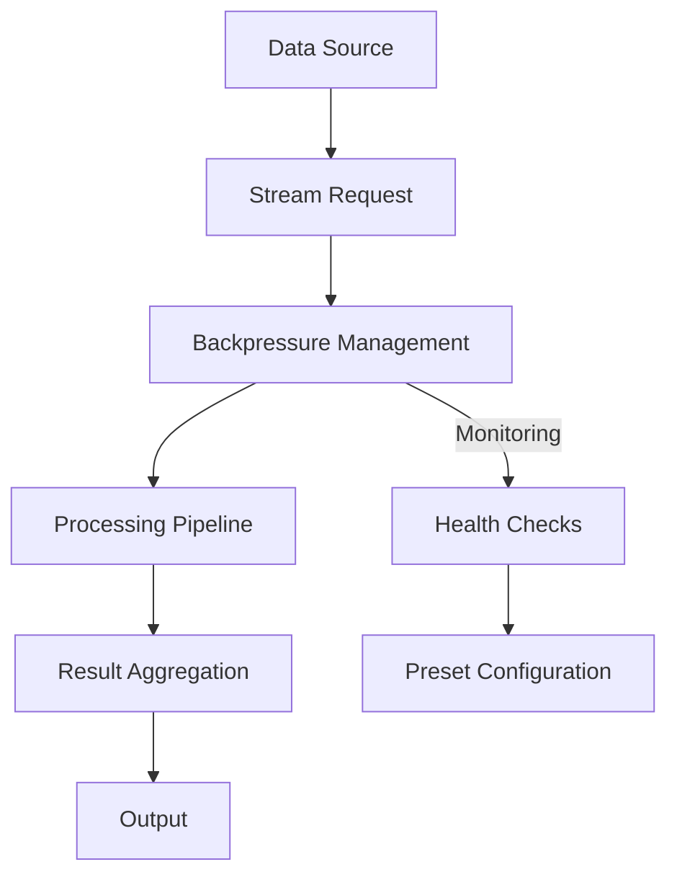

# Data Processing Example



## Data Processing Pipeline

```csharp
// Sample ETL pipeline using DataProcessing preset
services.AddMediator(cfg => {
    cfg.AddStreamingBackpressureBehavior(BackpressurePreset.DataProcessing);
    cfg.AddStreamingHealthCheckBehavior(HealthCheckPreset.LongRunning);
});

// Stream request definition
public record ProcessLargeDatasetQuery(string DatasetId) : IStreamRequest<ProcessedItem>;

// Handler implementation
public class ProcessLargeDatasetHandler : IStreamRequestHandler<ProcessedItem>
{
    public async IAsyncEnumerable<ProcessedItem> HandleAsync(
        ProcessLargeDatasetQuery request,
        [EnumeratorCancellation] CancellationToken cancellationToken)
    {
        // 1. Stream data from source
        await foreach (var rawItem in _dataSource.GetItemsStreamAsync(request.DatasetId))
        {
            // 2. Apply transformations
            var processed = TransformItem(rawItem);
            
            // 3. Yield processed item (automatically handles backpressure)
            yield return processed;
        }
    }
}
```

## Key Features

1. **Automatic Backpressure Management**
   - Buffer size: 10,000 items
   - Watermarks: 90%/60% 
   - Strategy: Buffer with Sample fallback

2. **Health Monitoring**
   - Check interval: 60 seconds
   - Stall detection: 5 minutes
   - Memory threshold: 2GB

3. **Built-in Resilience**
   - Automatic retries
   - Circuit breaking
   - Resource cleanup

## Related Documentation
- [Streaming Guide](../../api-reference/streaming.md)
- [Configuration Presets](../../configuration/presets.md)
- [Custom Behaviors](../../configuration/custom-behaviors.md)