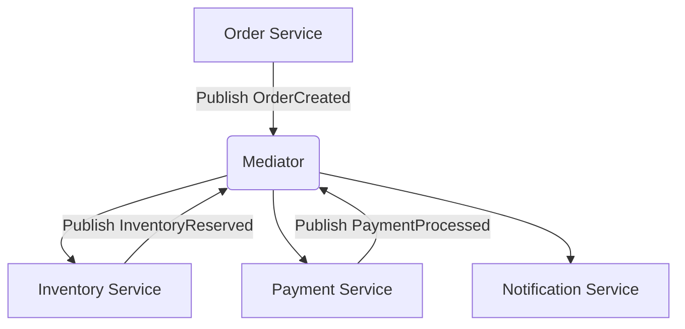
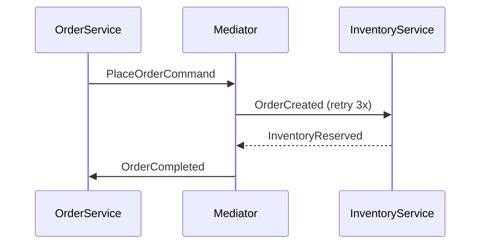

# Microservices Integration with FS.Mediator



## Core Concepts

FS.Mediator excels in microservices architectures by:
1. **Decoupling** services through message-based communication
2. **Orchestrating** complex workflows across service boundaries
3. **Handling** cross-cutting concerns like retries, circuit breaking, and observability

## Example: Order Processing Flow

```csharp
// OrderService.cs
public record PlaceOrderCommand(Guid OrderId, List<OrderItem> Items) : IRequest;

public class OrderService
{
    private readonly IMediator _mediator;
    
    public async Task ProcessOrder(Order order)
    {
        await _mediator.Send(new PlaceOrderCommand(order.Id, order.Items));
    }
}

// InventoryService.cs
public class ReserveInventoryHandler : INotificationHandler<OrderCreated>
{
    public async Task Handle(OrderCreated notification, CancellationToken ct)
    {
        // Inventory reservation logic
        await _mediator.Publish(new InventoryReserved(notification.OrderId));
    }
}
```

## Key Features for Microservices

### 1. Cross-Service Communication
- **Request/Response**: `IMediator.Send()` for direct service calls
- **Event Publishing**: `IMediator.Publish()` for pub/sub patterns
- **Streaming**: `IMediator.CreateStream()` for real-time data flows

### 2. Resilience Patterns


### 3. Monitoring & Observability

```csharp
// Configure health checks
services.AddFSMediator()
    .AddPipelineBehavior<MetricsBehavior>()
    .AddPipelineBehavior<LoggingBehavior>();
```

## Best Practices
1. **Design**:
   - Use clear event/command naming (e.g., `OrderCreated`)
   - Keep handlers focused on single responsibilities

2. **Performance**:
   - Use `IAsyncEnumerable` for high-volume streams
   - Apply backpressure presets for load management

3. **Error Handling**:
   - Implement circuit breakers for external service calls
   - Use dead-letter queues for failed messages

[Back to main documentation](../../../README.md)