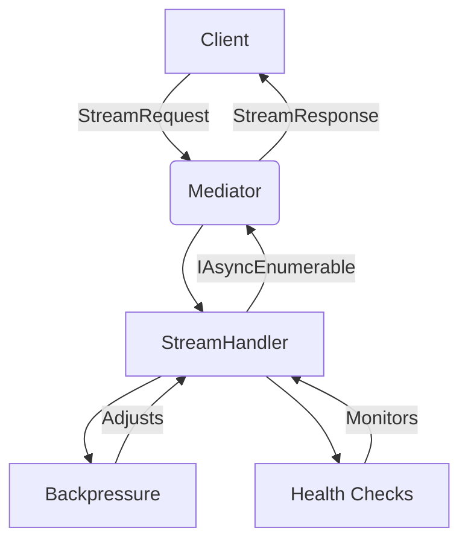
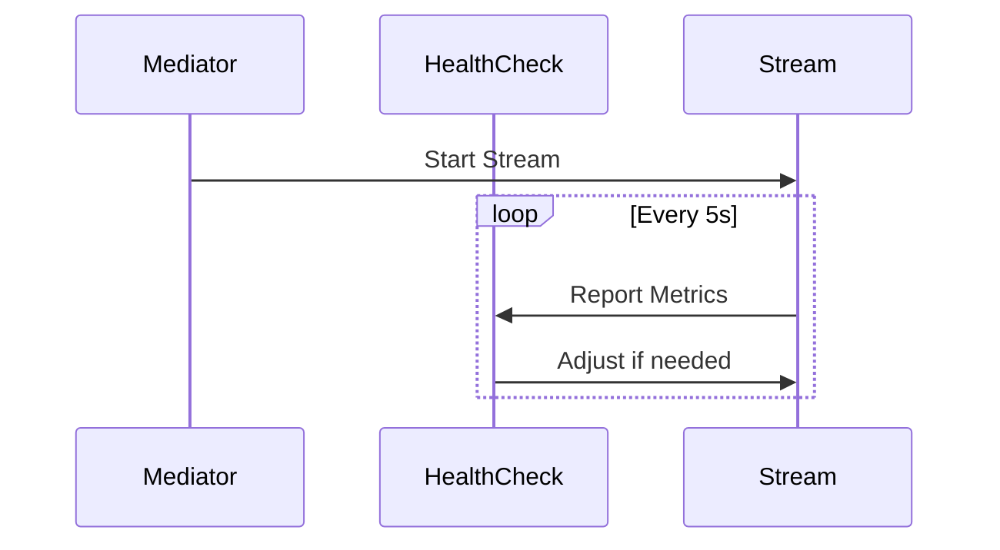

# Real-Time Processing with FS.Mediator



## Core Architecture

FS.Mediator's real-time capabilities are built on:
1. **Streaming Handlers** (`IStreamRequestHandler<TRequest, TResponse>`)
2. **Async Enumerables** (`IAsyncEnumerable<T>`)
3. **Pipeline Behaviors** for cross-cutting concerns

## Example: Real-Time Stock Ticker

```csharp
// Stream request definition
public record StockTickerQuery(string Symbol) : IStreamRequest<StockUpdate>;

// Stream handler implementation
public class StockTickerHandler : IStreamRequestHandler<StockTickerQuery, StockUpdate>
{
    public async IAsyncEnumerable<StockUpdate> HandleAsync(
        StockTickerQuery query,
        [EnumeratorCancellation] CancellationToken ct)
    {
        while (!ct.IsCancellationRequested)
        {
            var update = await GetLatestUpdate(query.Symbol);
            yield return update;
            await Task.Delay(1000, ct); // 1 update per second
        }
    }
}
```

## Key Components

### 1. Backpressure Management
Configured via `StreamingBackpressureBehavior` with strategies:
- **Buffer**: Temporary storage during spikes
- **Drop**: Discard excess items
- **Throttle**: Slow down producer

See @[docs/configuration/presets.md] for configuration presets.

### 2. Health Monitoring


### 3. Error Handling
Built-in behaviors:
- Automatic retry for transient errors
- Circuit breakers for sustained failures
- Dead-letter queues for failed messages

## Best Practices
1. **Performance**:
   - Use `ConfigureAwait(false)` in handlers
   - Limit buffer sizes with `BackpressurePreset`

2. **Reliability**:
   - Implement health checks (see @[docs/configuration/health-checks.md])
   - Use cancellation tokens properly

3. **Monitoring**:
   - Track stream metrics (items/sec, latency)
   - Log critical events

[Back to main documentation](../../../README.md)