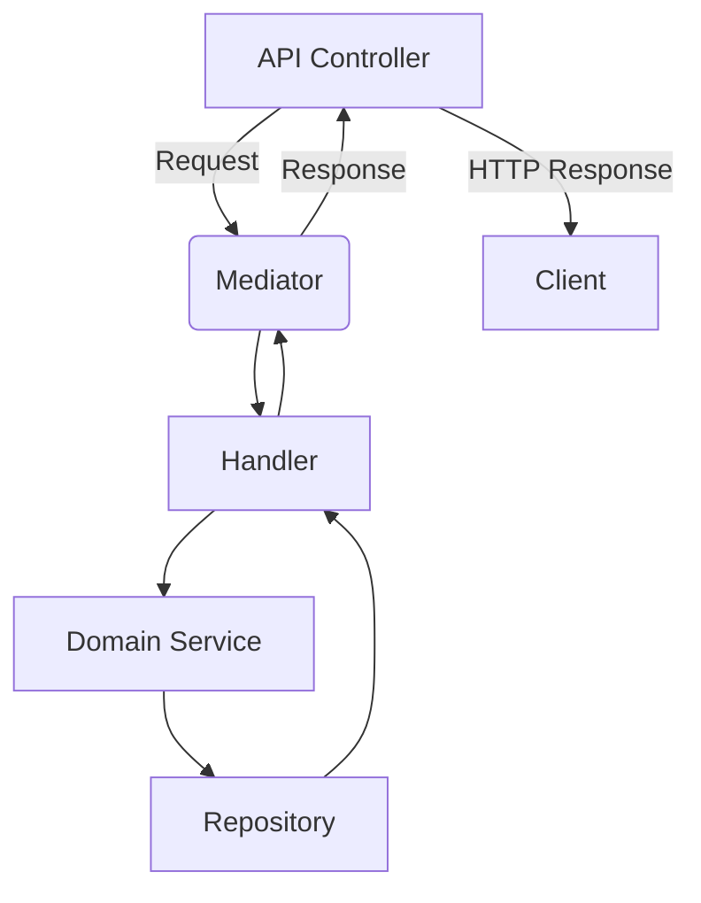

# Web API Integration with FS.Mediator



## Core Concepts

FS.Mediator provides clean separation between:
1. **API Layer**: HTTP concerns (routing, status codes)
2. **Mediator**: Request routing and pipeline execution
3. **Business Logic**: Pure C# classes without HTTP dependencies

## Basic Integration

### 1. Controller Example
```csharp
[ApiController]
[Route("api/[controller]")]
public class ProductsController : ControllerBase
{
    private readonly IMediator _mediator;

    public ProductsController(IMediator mediator) => _mediator = mediator;

    [HttpGet("{id}")]
    public async Task<ActionResult<ProductDto>> GetProduct(int id)
    {
        var product = await _mediator.SendAsync(new GetProductQuery(id));
        return Ok(product);
    }

    [HttpPost]
    public async Task<ActionResult> CreateProduct(CreateProductDto dto)
    {
        var result = await _mediator.SendAsync(new CreateProductCommand(
            dto.Name, 
            dto.Price, 
            dto.Category));
            
        return CreatedAtAction(nameof(GetProduct), new { id = result.Id }, result);
    }
}
```

### 2. Request/Command Definitions
```csharp
// Query
public record GetProductQuery(int Id) : IRequest<ProductDto>;

// Command 
public record CreateProductCommand(
    string Name,
    decimal Price,
    string Category) : IRequest<CreationResult>;
```

## Advanced Patterns

### 1. Streaming Endpoints
```csharp
[HttpGet("recent/{days}")]
public async IAsyncEnumerable<ProductDto> GetRecentProducts(int days, [EnumeratorCancellation] CancellationToken cancellationToken = default)
{
    await foreach (var product in _mediator.CreateStream(new GetRecentProductsQuery(days)))
    {
        yield return product;
    }
}
```

### 2. Error Handling
```csharp
// Global exception filter
public class MediatorExceptionFilter : IExceptionFilter
{
    public void OnException(ExceptionContext context)
    {
        if (context.Exception is ValidationException validationEx)
        {
            context.Result = new BadRequestObjectResult(validationEx.Errors);
        }
        else if (context.Exception is NotFoundException)
        {
            context.Result = new NotFoundResult();
        }
    }
}
```

## Best Practices

1. **Controller Design**:
   - Keep controllers thin (just mediation)
   - Use action-specific DTOs
   - Return proper HTTP status codes

2. **Performance**:
   - Use `[EnumeratorCancellation]` for streaming endpoints
   - Apply appropriate backpressure presets

3. **Documentation**:
   - Annotate with Swagger/OpenAPI attributes
   - Document response types

See also:
- [Configuration Presets](../../configuration/presets.md) for performance tuning
- [Real-Time Examples](../real-time/README.md) for streaming best practices

[Back to main documentation](../../../README.md)