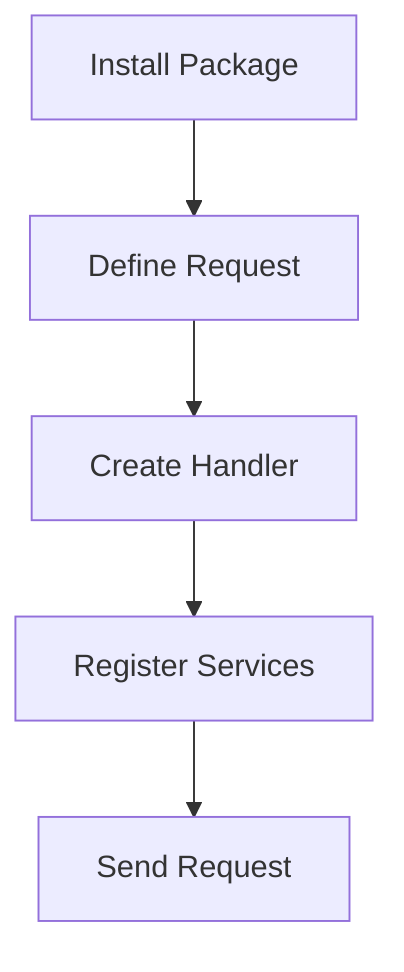

# Getting Started with FS.Mediator



## Installation

```bash
dotnet add package FS.Mediator
```

## Basic Usage

### 1. Define a Request
```csharp
public record GetUserById(int Id) : IRequest<User>;
```

### 2. Create a Handler
```csharp
public class GetUserByIdHandler : IRequestHandler<GetUserById, User>
{
    public async Task<User> Handle(GetUserById request, CancellationToken ct)
    {
        return await _userRepository.GetByIdAsync(request.Id, ct);
    }
}
```

### 3. Register Services
```csharp
// In Startup.cs or Program.cs
services.AddFSMediator(cfg => 
{
    cfg.RegisterHandlersFromAssemblyContaining<Startup>();
});
```

### 4. Send Requests
```csharp
var user = await _mediator.Send(new GetUserById(123));
```

## Project Structure


## Next Steps

- [Learn Core Concepts](../basic-concepts.md)
- [Explore Examples](../examples/)
- [Configure Behaviors](../configuration/behaviors.md)

## Troubleshooting

1. **Handler Not Found**:
   - Verify handler registration
   - Check assembly scanning

2. **Dependency Issues**:
   - Ensure handlers are registered in DI

3. **Performance Problems**:
   - Review [Performance Tips](../streaming/performance-tips.md)