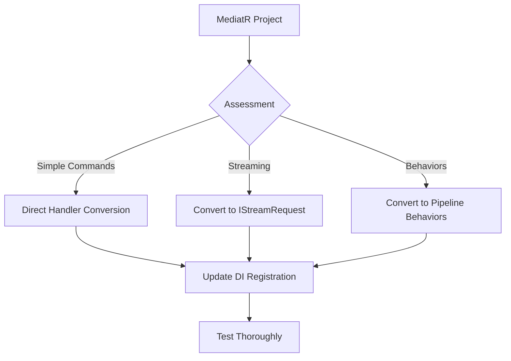

# Migrating from MediatR to FS.Mediator



## Key Differences

| Feature          | MediatR          | FS.Mediator       |
|------------------|------------------|-------------------|
| **Streaming**    | ❌ Not supported | ✅ Full support with `IStreamRequest` |
| **Behaviors**    | Global only      | Per-request configurable |
| **Performance**  | Good             | Optimized for high throughput |
| **DI Integration** | Basic          | Advanced with presets |

## Step-by-Step Migration

### 1. Update NuGet Packages
```bash
dotnet remove package MediatR
dotnet add package FS.Mediator
```

### 2. Request/Handler Conversion

#### MediatR:
```csharp
public class GetUserQuery : IRequest<UserDto>
{
    public int Id { get; set; }
}

public class GetUserHandler : IRequestHandler<GetUserQuery, UserDto>
{
    public Task<UserDto> Handle(GetUserQuery request, CancellationToken ct)
    {
        // implementation
    }
}
```

#### FS.Mediator:
```csharp
public record GetUserQuery(int Id) : IRequest<UserDto>;

public class GetUserHandler : IRequestHandler<GetUserQuery, UserDto>
{
    public async Task<UserDto> HandleAsync(GetUserQuery request, CancellationToken ct)
    {
        // implementation
    }
}
```

### 3. Streaming Conversion


#### FS.Mediator Streaming:
```csharp
public record GetLogEntries(DateTime From) : IStreamRequest<LogEntry>;

public class GetLogEntriesHandler : IStreamRequestHandler<GetLogEntries, LogEntry>
{
    public async IAsyncEnumerable<LogEntry> HandleAsync(
        GetLogEntries request,
        [EnumeratorCancellation] CancellationToken ct)
    {
        // streaming implementation
    }
}
```

### 4. Behavior Conversion

#### MediatR Behavior:
```csharp
public class LoggingBehavior<TRequest, TResponse> : IPipelineBehavior<TRequest, TResponse>
{
    public async Task<TResponse> Handle(
        TRequest request,
        RequestHandlerDelegate<TResponse> next,
        CancellationToken ct)
    {
        // logging logic
        return await next();
    }
}
```

#### FS.Mediator Behavior:
```csharp
public class LoggingBehavior<TRequest, TResponse> : IPipelineBehavior<TRequest, TResponse>
{
    public async Task<TResponse> HandleAsync(
        TRequest request,
        RequestHandlerDelegate<TResponse> next,
        CancellationToken ct)
    {
        // logging logic
        return await next();
    }
}
```

## Common Issues & Solutions

1. **Missing Handlers**:
   - Check DI registration used `AddFSMediator()` instead of `AddMediatR()`
   - Verify handler signatures use `HandleAsync`

2. **Streaming Not Working**:
   - Ensure you're using `IAsyncEnumerable` in both request and client code
   - Apply proper backpressure presets from [Configuration Presets](../../configuration/presets.md)

3. **Behavior Ordering**:
   - Use `ConfigurePipeline()` to explicitly define behavior order
   - See [Pipeline Configuration](../../configuration/pipeline.md) for advanced configuration

## Next Steps

- [Explore Presets](../../configuration/presets.md) for performance tuning
- [Review Examples](../examples/README.md) for implementation patterns
- [Check Upgrade Guide](upgrade.md) for version-specific changes