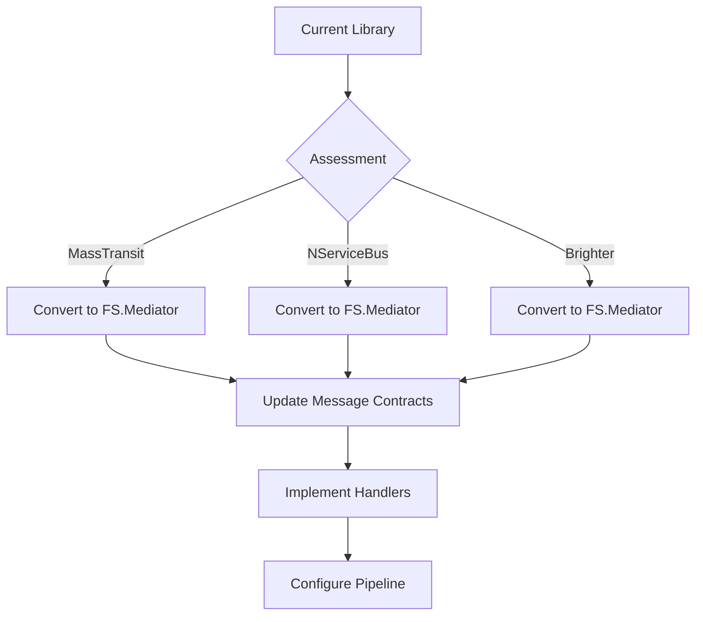
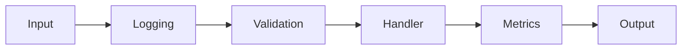

# Migrating from Other Mediator Libraries to FS.Mediator



## Library Comparison

| Feature          | MassTransit      | NServiceBus      | Brighter         | FS.Mediator      |
|------------------|------------------|------------------|------------------|------------------|
| **Streaming**    | Limited          | ❌ Not supported | ❌ Not supported | ✅ Full support  |
| **Performance**  | Good             | Moderate         | Good             | Excellent        |
| **DI**          | Advanced         | Basic            | Moderate         | Advanced         |
| **Behaviors**   | Filters          | Pipeline         | Handlers         | Configurable     |

## Step-by-Step Migration

### 1. Message Contract Conversion

#### MassTransit Example:
```csharp
// Before
public class SubmitOrder : CorrelatedBy<Guid>
{
    public Guid CorrelationId { get; set; }
    public string OrderData { get; set; }
}

// After
public record SubmitOrder(Guid CorrelationId, string OrderData) : IRequest<OrderResult>;
```

### 2. Handler Implementation

#### NServiceBus Example:
```csharp
// Before
public class SubmitOrderHandler : IHandleMessages<SubmitOrder>
{
    public Task Handle(SubmitOrder message, IMessageHandlerContext context)
    {
        // implementation
    }
}

// After
public class SubmitOrderHandler : IRequestHandler<SubmitOrder, OrderResult>
{
    public async Task<OrderResult> HandleAsync(SubmitOrder request, CancellationToken ct)
    {
        // implementation
    }
}
```

### 3. Pipeline Configuration



#### Brighter Example:
```csharp
// Configure pipeline behaviors
services.AddFSMediator(cfg => 
{
    cfg.AddBehavior<LoggingBehavior>();
    cfg.AddBehavior<ValidationBehavior>();
    cfg.AddBehavior<MetricsBehavior>();
});
```

## Key Considerations

1. **Error Handling**:
   - Convert dead-letter queues to [Retry Policies](../resilience/retry-patterns.md)
   - Replace saga workflows with [Streaming Handlers](../streaming/advanced-streaming.md)

2. **Performance**:
   - Apply [Backpressure Presets](../resilience/backpressure.md) for high-load scenarios
   - Use [Performance Tips](../streaming/performance-tips.md) for streaming

3. **Monitoring**:
   - Implement [Health Checks](../monitoring/health-checks.md)
   - Configure [Metrics Collection](../monitoring/metrics.md)

## Next Steps

- [Review Core Concepts](../../basic-concepts.md) for FS.Mediator fundamentals
- [Explore API Reference](../../api-reference/core-interfaces.md) for interface details
- [Check Migration Examples](../from-mediatr.md) for additional patterns