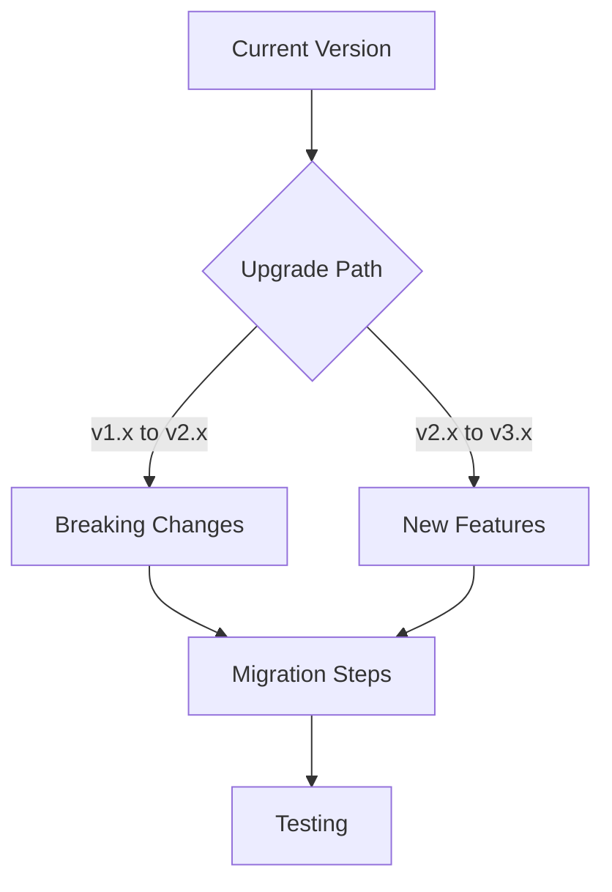

# FS.Mediator Version Upgrade Guide



## Version Compatibility

| Version | .NET Core | .NET 5+ | Features |
|---------|-----------|---------|----------|
| v1.x    | 3.1+   |      | Basic Mediator |
| v2.x    |         | 5+   | Streaming Support |
| v3.x    |         | 6+   | Advanced Pipeline |

## Breaking Changes

### v1.x to v2.x
1. **Handler Interface Changes**:
```csharp
// Before (v1.x)
public Task<TResponse> Handle(TRequest request, CancellationToken ct);

// After (v2.x)
public async Task<TResponse> HandleAsync(TRequest request, CancellationToken ct);
```

2. **DI Registration**:
```csharp
// Updated registration pattern
services.AddFSMediator(cfg => cfg.RegisterHandlersFromAssemblyContaining<Startup>());
```

## New Features

### v2.x Highlights
- [Streaming Support](../streaming/overview.md)
- [Backpressure Management](../resilience/backpressure.md)

### v3.x Highlights
- [Custom Pipeline Ordering](../configuration/behaviors.md)
- [Enhanced Monitoring](../monitoring/metrics.md)

## Step-by-Step Upgrade

1. **Update Dependencies**:
```bash
dotnet list package
dotnet update package FS.Mediator
```

2. **Test Critical Paths**:
- Command handlers
- Query handlers
- Streaming endpoints

3. **Verify Behaviors**:


## Troubleshooting

1. **Missing Handlers**:
   - Verify `AddFSMediator()` registration
   - Check handler signature uses `HandleAsync`

2. **Streaming Issues**:
   - Review [Streaming Migration Guide](../streaming/advanced-streaming.md)
   - Check [Backpressure Settings](../resilience/backpressure.md)

## Next Steps

- [Review Release Notes](https://github.com/furkansarikaya/FS.Mediator/releases)
- [Explore New Features](../api-reference/core-interfaces.md)
- [Test Performance](../streaming/performance-tips.md)