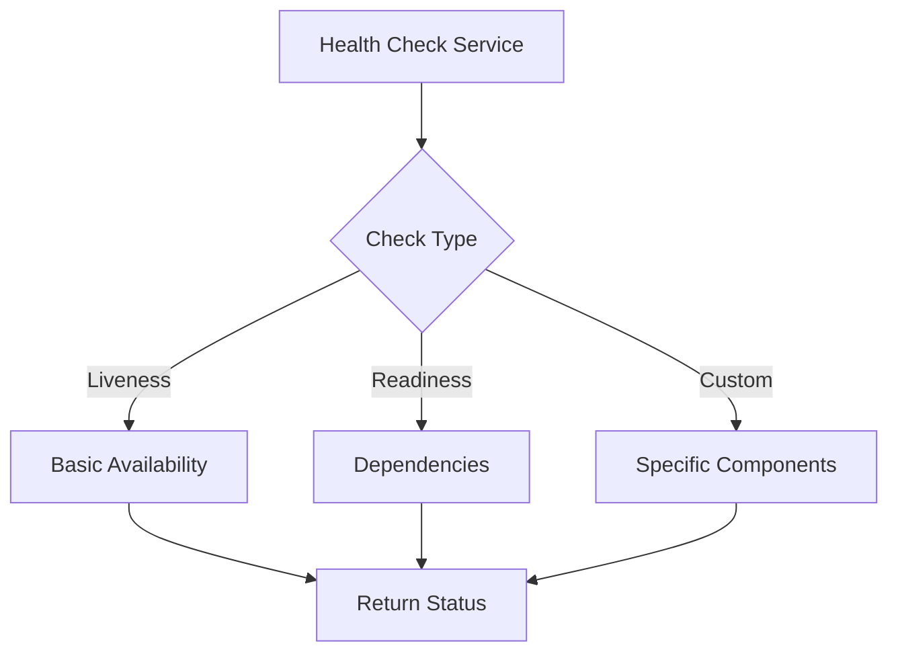

# FS.Mediator Health Checks



## Built-in Health Checks

### 1. Mediator Core Health
```csharp
services.AddHealthChecks()
    .AddFSMediatorCore() // Checks mediator infrastructure
    .AddFSMediatorHandlers() // Verifies handler registration
```

### 2. Streaming Health
```csharp
services.AddHealthChecks()
    .AddFSMediatorStreaming(maxBackpressureThreshold: 5000)
```

## Custom Health Checks

### Example: Database-Backed Handler
```csharp
public class DatabaseHealthCheck : IHealthCheck
{
    public async Task<HealthCheckResult> CheckHealthAsync(
        HealthCheckContext context, 
        CancellationToken ct)
    {
        var isHealthy = await CheckDatabaseConnectionAsync();
        return isHealthy 
            ? HealthCheckResult.Healthy()
            : HealthCheckResult.Unhealthy("Database connection failed");
    }
}

// Registration
services.AddHealthChecks()
    .AddCheck<DatabaseHealthCheck>("database");
```

## Configuration

### Endpoint Setup
```csharp
app.UseEndpoints(endpoints =>
{
    endpoints.MapHealthChecks("/health", new HealthCheckOptions
    {
        ResponseWriter = async (context, report) =>
        {
            context.Response.ContentType = "application/json";
            await context.Response.WriteAsync(
                JsonSerializer.Serialize(new
                {
                    status = report.Status,
                    components = report.Entries
                }));
        }
    });
});
```

### Threshold Configuration
```json
{
  "HealthChecks": {
    "EvaluationTimeInSeconds": 10,
    "MaximumHistoryEntriesPerEndpoint": 50
  }
}
```

## Monitoring Integration

1. **Dashboard Setup**:
   - Connect to [Metrics Dashboard](../monitoring/metrics.md)
   - Configure alerts from [Troubleshooting Guide](../monitoring/troubleshooting.md)

2. **Kubernetes Probes**:
```yaml
livenessProbe:
  httpGet:
    path: /health/live
    port: 80
  initialDelaySeconds: 30
  periodSeconds: 60

readinessProbe:
  httpGet:
    path: /health/ready
    port: 80
  initialDelaySeconds: 5
  periodSeconds: 10
```

## Best Practices

1. **Check Granularity**:
   - Separate liveness vs readiness checks
   - Group related dependencies

2. **Performance**:
   - Set reasonable timeouts
   - Cache results where appropriate

3. **Alerting**:
   - Use [Metrics Integration](../monitoring/metrics.md)
   - Configure [Logging](../monitoring/logging.md)

## Troubleshooting

1. **False Positives**:
   - Verify check timeouts
   - Check dependency configurations

2. **Performance Issues**:
   - Review [Performance Tips](../streaming/performance-tips.md)
   - Adjust check frequency

## Next Steps

- [Explore Metrics](../monitoring/metrics.md) for monitoring
- [Review Logging](../monitoring/logging.md) configurations
- [Check API Reference](../api-reference/configuration.md) for advanced options