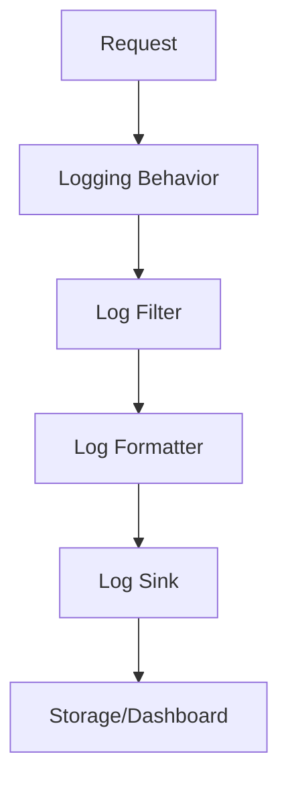

# FS.Mediator Logging Configuration



## Built-in Logging Features

### 1. Request/Response Logging
```csharp
services.AddFSMediator(cfg => 
{
    cfg.AddBehavior<RequestLoggingBehavior>();
    cfg.AddBehavior<ResponseLoggingBehavior>();
});
```

### 2. Structured Logging
```json
{
  "Logging": {
    "FS.Mediator": {
      "LogLevel": "Information",
      "Formatter": "Json"
    }
  }
}
```

## Custom Logging Setup

### Example: Serilog Configuration
```csharp
Log.Logger = new LoggerConfiguration()
    .MinimumLevel.Information()
    .Enrich.FromLogContext()
    .WriteTo.Console(outputTemplate:
        "[{Timestamp:HH:mm:ss} {Level}] {Message}{NewLine}{Exception}")
    .WriteTo.File("logs/mediator-.txt", rollingInterval: RollingInterval.Day)
    .CreateLogger();

services.AddLogging(logging => 
{
    logging.AddSerilog();
});
```

## Log Categories

| Category | Description | Recommended Level |
|----------|-------------|-------------------|
| FS.Mediator.Core | Core mediator operations | Information |
| FS.Mediator.Handlers | Handler execution | Debug |
| FS.Mediator.Streaming | Streaming operations | Warning |
| FS.Mediator.Pipeline | Pipeline behaviors | Trace |

## Advanced Configuration

### 1. Filtering Logs
```csharp
services.AddLogging(logging =>
{
    logging.AddFilter("FS.Mediator.Streaming", LogLevel.Warning);
    logging.AddFilter<Microsoft.EntityFrameworkCore>(LogLevel.None);
});
```

### 2. Enrichment
```csharp
services.AddFSMediator(cfg =>
{
    cfg.AddLogEnricher<CorrelationIdEnricher>();
    cfg.AddLogEnricher<RequestTypeEnricher>();
});
```

## Integration with Monitoring

1. **ELK Stack**:
   - Configure [Logstash input](https://www.elastic.co/guide/en/logstash/current/plugins-inputs-http.html)
   - Create [Kibana dashboards](../monitoring/metrics.md)

2. **Application Insights**:
```csharp
services.AddApplicationInsightsTelemetry();
services.AddLogging(logging =>
{
    logging.AddApplicationInsights();
});
```

## Best Practices

1. **Performance**:
   - Use async logging
   - Avoid expensive operations in log messages

2. **Security**:
   - Sanitize sensitive data
   - Use [structured logging](../monitoring/troubleshooting.md#logging)

3. **Troubleshooting**:
   - Include correlation IDs
   - Log exceptions with context

## Troubleshooting

1. **Missing Logs**:
   - Check log level configuration
   - Verify logger category names

2. **Performance Issues**:
   - Review [Performance Tips](../streaming/performance-tips.md)
   - Adjust log verbosity

## Next Steps

- [Explore Metrics](../monitoring/metrics.md) for monitoring
- [Review Health Checks](../monitoring/health-checks.md) configurations
- [Check API Reference](../api-reference/core-interfaces.md#logging)