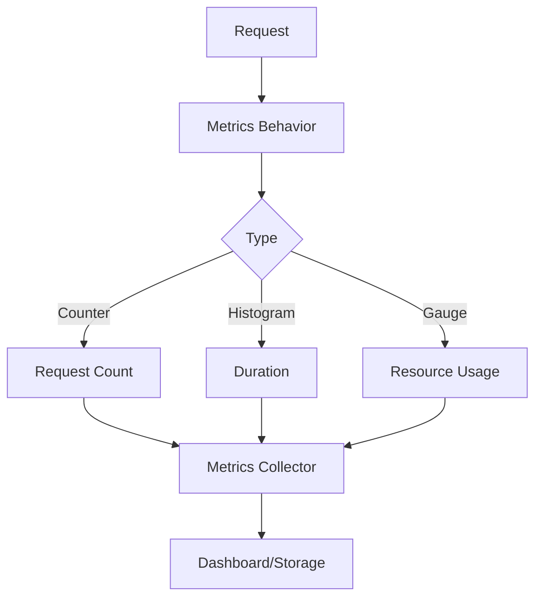

# FS.Mediator Metrics Monitoring



## Built-in Metrics

### 1. Core Metrics
```csharp
services.AddFSMediator(cfg => 
{
    cfg.AddBehavior<RequestMetricsBehavior>();
    cfg.AddBehavior<DurationMetricsBehavior>();
});
```

### 2. Streaming Metrics
```csharp
services.AddFSMediator(cfg =>
{
    cfg.AddBehavior<StreamingMetricsBehavior>(
        bufferSizeMetric: true,
        throughputMetric: true
    );
});
```

## Metrics Configuration

### Prometheus Example
```csharp
public void Configure(IApplicationBuilder app)
{
    app.UseMetricServer("/metrics");
    app.UseHttpMetrics();
}

public void ConfigureServices(IServiceCollection services)
{
    services.AddMetrics();
    services.AddPrometheusMetrics();
}
```

## Key Metrics

| Metric | Type | Description | Labels |
|--------|------|-------------|--------|
| mediator_requests_total | Counter | Total requests | type,status |
| mediator_request_duration_seconds | Histogram | Request duration | type |
| mediator_stream_buffer_size | Gauge | Streaming buffer size | handler |
| mediator_active_requests | Gauge | Concurrent requests | - |

## Dashboard Integration

### 1. Grafana Setup
```json
{
  "panels": [
    {
      "title": "Request Rate",
      "type": "graph",
      "targets": [{
        "expr": "rate(mediator_requests_total[1m])",
        "legendFormat": "{{type}}"
      }]
    }
  ]
}
```

### 2. Alert Rules
```yaml
groups:
- name: mediator.rules
  rules:
  - alert: HighErrorRate
    expr: rate(mediator_requests_total{status=~"5.."}[1m]) > 0.1
    for: 5m
```

## Best Practices

1. **Cardinality**:
   - Limit label values
   - Avoid high-dimension metrics

2. **Performance**:
   - Sample expensive metrics
   - Use [Performance Tips](../streaming/performance-tips.md)

3. **Monitoring**:
   - Combine with [Logging](../monitoring/logging.md)
   - Set up [Health Checks](../monitoring/health-checks.md)

## Troubleshooting

1. **Missing Metrics**:
   - Verify behavior registration
   - Check scrape configurations

2. **Performance Impact**:
   - Review metric collection intervals
   - Disable unused metrics

## Next Steps

- [Explore Logging](../monitoring/logging.md) for correlation
- [Review Health Checks](../monitoring/health-checks.md) setup
- [Check API Reference](../api-reference/configuration.md#metrics)