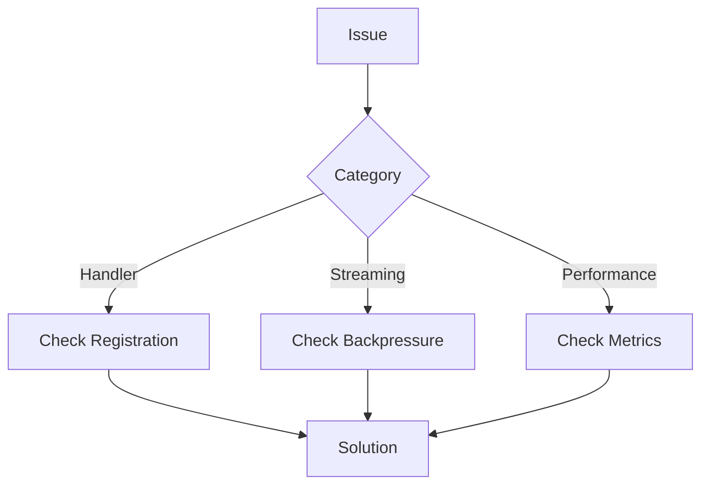

# FS.Mediator Troubleshooting Guide



## Common Issues

### 1. Missing Handlers
**Symptoms**:
- `HandlerNotFoundException` errors
- Requests fail with no handler execution

**Solutions**:
1. Verify DI registration:
```csharp
// Correct registration:
services.AddFSMediator(cfg => cfg.RegisterHandlersFromAssemblyContaining<Startup>());
```
2. Check handler implements correct interface:
```csharp
public class MyHandler : IRequestHandler<MyRequest, MyResponse>
```
3. See [Handler Documentation](../api-reference/core-interfaces.md#handlers)

### 2. Streaming Issues
**Symptoms**:
- Streams terminate unexpectedly
- High memory usage
- Slow consumers

**Solutions**:
1. Apply proper backpressure:
```csharp
services.AddFSMediator(cfg => 
{
    cfg.AddStreamingBackpressure(BackpressureStrategy.Throttle, 1000);
});
```
2. Monitor with [Streaming Metrics](../monitoring/metrics.md#streaming)
3. Review [Streaming Best Practices](../streaming/performance-tips.md)

## Diagnostic Tools

### 1. Log Analysis


Key log patterns to check:
- Handler execution times
- Exception stack traces
- Pipeline behavior logs

### 2. Metrics Analysis
1. Check request rates
2. Review error percentages
3. Monitor streaming buffer sizes

## Performance Issues

### 1. High Latency
**Investigation Steps**:
1. Check [Request Duration Metrics](../monitoring/metrics.md#core-metrics)
2. Review [Pipeline Behaviors](../configuration/behaviors.md)
3. Profile handler execution

### 2. Memory Leaks
**Checklist**:
- Streaming handler disposal
- Async resource cleanup
- Large object allocations

## Error Reference

| Error | Cause | Solution |
|-------|-------|----------|
| HandlerNotFoundException | Missing registration | Verify DI setup |
| StreamTimeoutException | Slow consumer | Apply backpressure |
| PipelineValidationException | Invalid request | Check validation rules |

## Next Steps

- [Review Metrics](../monitoring/metrics.md) for patterns
- [Check Health Status](../monitoring/health-checks.md)
- [Explore Logging](../monitoring/logging.md) for details