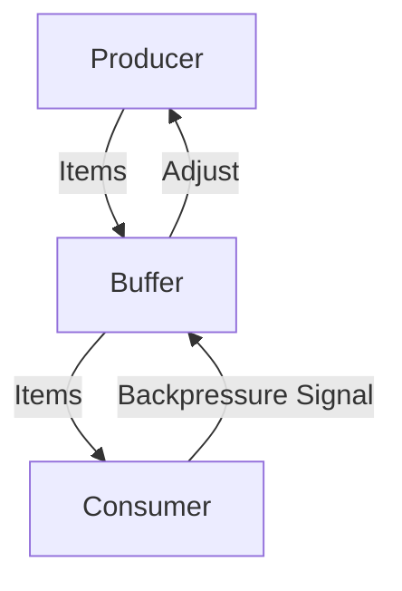

# Backpressure Management in FS.Mediator



## Backpressure Strategies

### 1. Buffer Strategy
```csharp
services.AddFSMediator(cfg => 
{
    cfg.AddStreamingBackpressure(
        strategy: BackpressureStrategy.Buffer,
        bufferSize: 1000,
        highWaterMark: 800,
        lowWaterMark: 200
    );
});
```

### 2. Throttle Strategy
```csharp
services.AddFSMediator(cfg => 
{
    cfg.AddStreamingBackpressure(
        strategy: BackpressureStrategy.Throttle,
        maxItemsPerSecond: 500
    );
});
```

### 3. Drop Strategy
```csharp
services.AddFSMediator(cfg => 
{
    cfg.AddStreamingBackpressure(
        strategy: BackpressureStrategy.Drop,
        bufferSize: 500
    );
});
```

## Configuration Parameters

| Parameter | Type | Description | Default |
|-----------|------|-------------|---------|
| strategy | enum | Buffer, Throttle, Drop, etc. | Buffer |
| bufferSize | int | Max items to buffer | 1000 |
| highWaterMark | int | When to slow down (percentage) | 80 |
| lowWaterMark | int | When to resume (percentage) | 20 |

## Monitoring Backpressure


Key metrics to monitor:
- `mediator_stream_buffer_usage`
- `mediator_stream_backpressure_events`
- `mediator_stream_dropped_items`

See [Streaming Metrics](../monitoring/metrics.md#streaming) for setup.

## Best Practices

1. **Sizing Buffers**:
   - Calculate based on average processing time
   - Consider memory constraints

2. **Strategy Selection**:
   - Use Buffer for ordered, non-critical streams
   - Use Throttle for consistent throughput
   - Use Drop for real-time but non-critical data

3. **Error Handling**:
   - Implement fallback mechanisms
   - Log backpressure events

## Troubleshooting

1. **High Memory Usage**:
   - Reduce buffer sizes
   - Switch to Drop strategy

2. **Slow Processing**:
   - Increase consumer parallelism
   - Optimize handler performance

3. **Data Loss**:
   - Implement retry mechanisms
   - Consider persistent buffers

## Next Steps

- [Review Streaming Documentation](../streaming/advanced-streaming.md)
- [Explore Resilience Patterns](../resilience/overview.md)
- [Check Performance Tips](../streaming/performance-tips.md)