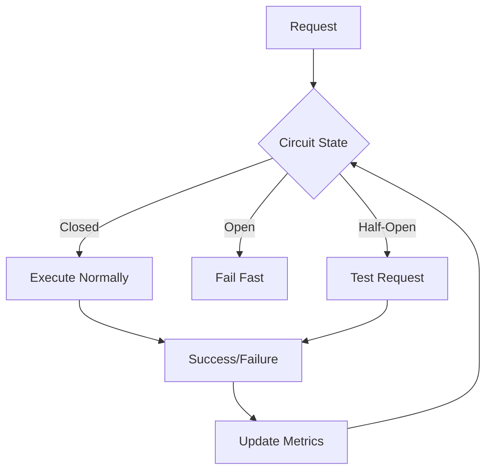

# Circuit Breaker Pattern in FS.Mediator



## Configuration

### Basic Setup
```csharp
services.AddFSMediator(cfg => 
{
    cfg.AddCircuitBreaker(options => 
    {
        options.FailureThreshold = 0.5; // 50% failures
        options.SamplingDuration = TimeSpan.FromSeconds(30);
        options.MinimumThroughput = 10;
        options.DurationOfBreak = TimeSpan.FromMinutes(1);
    });
});
```

### Advanced Configuration
```csharp
services.AddFSMediator(cfg => 
{
    cfg.AddCircuitBreaker<MyRequest>(options => 
    {
        options.FailureThreshold = 0.7;
        options.OnBreak = (ctx, state) => 
            logger.LogWarning("Circuit broken for {RequestType}", typeof(MyRequest));
        options.OnReset = () => 
            logger.LogInformation("Circuit reset");
    });
});
```

## State Transitions

| State | Description | Behavior |
|-------|-------------|----------|
| Closed | Normal operation | All requests execute |
| Open | Circuit tripped | Fail fast with CircuitBrokenException |
| Half-Open | Testing recovery | Single test request allowed |

## Monitoring

Key metrics to track:
- `mediator_circuit_state` (0=Closed, 1=Half-Open, 2=Open)
- `mediator_circuit_failure_rate`
- `mediator_circuit_operations`

See [Metrics Documentation](../monitoring/metrics.md) for setup.

## Best Practices

1. **Threshold Tuning**:
   - Start conservative (e.g. 60% failure threshold)
   - Adjust based on [Monitoring](../monitoring/metrics.md) data

2. **Request Isolation**:
   - Consider separate circuits for:
     - Different request types
     - Different downstream services

3. **Fallback Strategies**:
   - Implement fallback handlers
   - [Use Retry Patterns appropriately](../resilience/retry-patterns.md)

## Troubleshooting

1. **False Tripping**:
   - Increase MinimumThroughput
   - Review failure detection logic

2. **Slow Recovery**:
   - Adjust DurationOfBreak
   - Check Half-Open test success rate

3. **Cascading Failures**:
   - Implement Bulkhead Isolation
   - Review dependency health

## Next Steps

- [Explore Retry Policies](../resilience/retry-patterns.md)
- Review Bulkhead Pattern
- [Check Health Checks](../monitoring/health-checks.md)