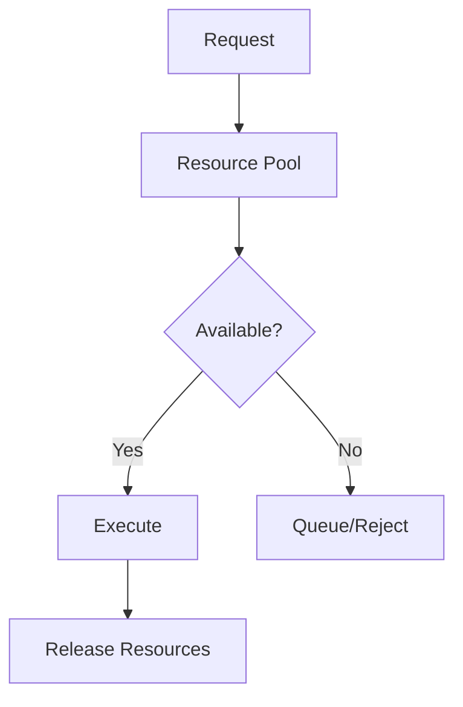

# Resource Management in FS.Mediator



## Resource Limiting Strategies

### 1. Concurrency Limiting
```csharp
services.AddFSMediator(cfg => 
{
    cfg.AddResourceLimiter(options => 
    {
        options.MaxConcurrentRequests = 100;
        options.MaxQueueLength = 50;
    });
});
```

### 2. Memory-Based Throttling
```csharp
services.AddFSMediator(cfg => 
{
    cfg.AddMemoryLimiter(options => 
    {
        options.MemoryThreshold = 0.8; // 80% of system memory
        options.SamplingInterval = TimeSpan.FromSeconds(5);
    });
});
```

## Configuration Parameters

| Parameter | Type | Description | Default |
|-----------|------|-------------|---------|
| MaxConcurrentRequests | int | Maximum parallel executions | 100 |
| MaxQueueLength | int | Maximum queued requests | 50 |
| MemoryThreshold | double | Memory usage threshold (0-1) | 0.8 |
| SamplingInterval | TimeSpan | Resource check frequency | 5s |

## Monitoring Resources

Key metrics to track:
- `mediator_resources_available`
- `mediator_resources_utilization`
- `mediator_requests_queued`

See [Metrics Documentation](../monitoring/metrics.md) for setup.

## Best Practices

1. **Sizing Limits**:
   - Base on system resources
   - Consider request patterns

2. **Fallback Behavior**:
   - Implement graceful degradation
   - Provide clear error messages

3. **Monitoring**:
   - Set alerts for high utilization
   - Track request queue growth

## Troubleshooting

1. **High Rejection Rate**:
   - Adjust concurrency limits
   - Scale resources

2. **Memory Pressure**:
   - Reduce buffer sizes
   - Optimize handlers

3. **Queue Backlog**:
   - Increase processing capacity
   - Implement prioritization

## Next Steps

- [Review Circuit Breakers](../resilience/circuit-breaker.md)
- [Explore Backpressure](../resilience/backpressure.md)
- [Check Health Checks](../monitoring/health-checks.md)