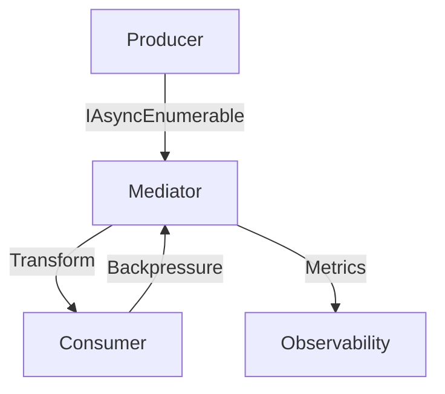
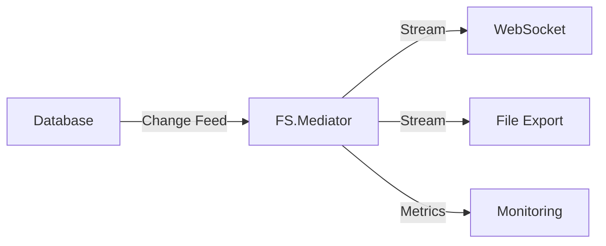

# Advanced Streaming Patterns in FS.Mediator



## Core Streaming Components

### 1. Stream Transformation
```csharp
public async IAsyncEnumerable<Result> Handle(
    StreamRequest request,
    [EnumeratorCancellation] CancellationToken cancellationToken)
{
    await foreach (var item in _source.GetItemsAsync(cancellationToken))
    {
        yield return Transform(item);
        
        // Cooperative cancellation
        cancellationToken.ThrowIfCancellationRequested();
    }
}
```

### 2. Batching Patterns
```csharp
await foreach (var batch in _mediator.CreateStream(request)
    .Buffer(100) // Batch size
    .WithCancellation(cancellationToken))
{
    await ProcessBatch(batch);
}
```

## Advanced Configurations

### 1. Parallel Streaming
```csharp
services.AddFSMediator(cfg => 
{
    cfg.AddStreamingPipeline(options => 
    {
        options.MaxDegreeOfParallelism = 4;
        options.BufferCapacity = 1000;
    });
});
```

### 2. Error Handling
```csharp
public async IAsyncEnumerable<Result> Handle(
    StreamRequest request,
    [EnumeratorCancellation] CancellationToken cancellationToken)
{
    await foreach (var item in _source.GetItemsAsync(cancellationToken))
    {
        try {
            yield return Process(item);
        }
        catch (Exception ex) when (ex is not OperationCanceledException)
        {
            _logger.LogError(ex, "Processing failed");
            yield return CreateFallback(item);
        }
    }
}
```

## Performance Optimization

| Technique | Benefit | Implementation |
|-----------|---------|----------------|
| Batching | Reduced overhead | `Buffer()` operator |
| Parallelism | Higher throughput | `ParallelForEachAsync` |
| Caching | Faster access | `Memoize()` operator |

## Integration Patterns



## Best Practices

1. **Resource Management**:
   - Implement proper disposal
   - Use [Resource Limits](../resilience/resource-management.md)

2. **Error Recovery**:
   - Implement retry policies
   - Use dead-letter queues

3. **Monitoring**:
   - Track stream throughput
   - Monitor buffer utilization

## Next Steps

- [Review Basic Streaming](../streaming/getting-started.md)
- [Explore Backpressure](../resilience/backpressure.md)
- [Check Performance Tips](../streaming/performance-tips.md)