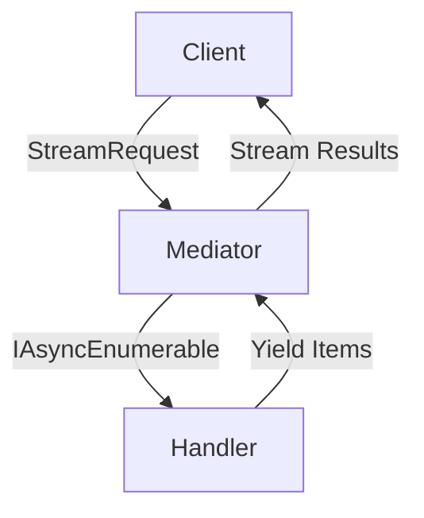

# Basic Streaming in FS.Mediator



## Core Concepts

### 1. Stream Request Definition
```csharp
public record StockQuoteStream(string Symbol) : IStreamRequest<StockQuote>;

public class StockQuote
{
    public decimal Price { get; init; }
    public DateTimeOffset Timestamp { get; init; }
}
```

### 2. Stream Handler Implementation
```csharp
public class StockQuoteStreamHandler : IStreamRequestHandler<StockQuoteStream, StockQuote>
{
    public async IAsyncEnumerable<StockQuote> Handle(
        StockQuoteStream request,
        [EnumeratorCancellation] CancellationToken cancellationToken)
    {
        while (!cancellationToken.IsCancellationRequested)
        {
            yield return await _stockService.GetLatestQuoteAsync(request.Symbol);
            await Task.Delay(1000, cancellationToken); // Poll every second
        }
    }
}
```

## Basic Configuration

### 1. Service Registration
```csharp
services.AddFSMediator(cfg => 
{
    cfg.RegisterStreamHandlersFromAssemblyContaining<Startup>();
});
```

### 2. Client Consumption
```csharp
await foreach (var quote in _mediator.CreateStream(new StockQuoteStream("MSFT")), cancellationToken)
{
    Console.WriteLine($"{quote.Timestamp}: {quote.Price}");
}
```

## Key Features

| Feature | Description | Example Use Case |
|---------|-------------|------------------|
| Async Streams | Efficient data flow | Real-time quotes |
| Cancellation | Graceful termination | User stops request |
| DI Integration | Seamless handler resolution | Injecting services |

## Best Practices

1. **Resource Cleanup**:
   - Always implement cancellation
   - Dispose resources properly

2. **Error Handling**:
   - Catch and handle exceptions
   - Consider retry policies

3. **Performance**:
   - Avoid blocking in handlers
   - Use [Performance Tips](../streaming/performance-tips.md)

## Next Steps

- [Explore Advanced Patterns](../streaming/advanced-streaming.md)
- [Learn About Backpressure](../resilience/backpressure.md)
- [Review Monitoring Setup](../monitoring/metrics.md)