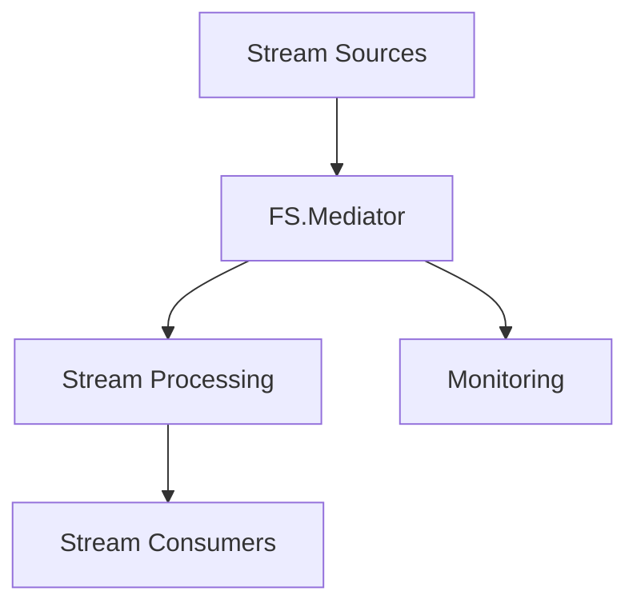
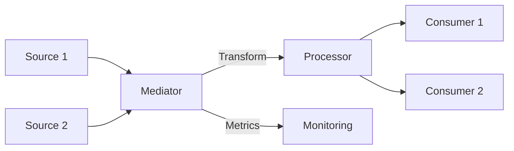

# Streaming Overview in FS.Mediator



## Core Components

### 1. Stream Sources
```csharp
// Database change feed
public async IAsyncEnumerable<Change> GetDatabaseChanges()

// External API stream
public async IAsyncEnumerable<Quote> GetStockQuotes()

// Event stream
public async IAsyncEnumerable<Event> GetEventStream()
```

### 2. Stream Processing
```csharp
services.AddFSMediator(cfg => 
{
    cfg.AddStreamingBehaviors(
        logging: true,
        metrics: true,
        backpressure: BackpressureStrategy.Buffer
    );
});
```

## Architecture



## Key Benefits

| Feature | Advantage |
|---------|-----------|
| Async Streams | Efficient memory usage |
| Cancellation | Responsive termination |
| Backpressure | System protection |
| Monitoring | Real-time visibility |

## Getting Started

1. **Basic Streaming**:
   - [Simple Stream Example](../streaming/basic-streaming.md)

2. **Advanced Patterns**:
   - [Parallel Processing](../streaming/advanced-streaming.md)
   - [Error Recovery](../resilience/error-handling.md)

3. **Production Ready**:
   - [Monitoring Setup](../monitoring/metrics.md)
   - [Performance Tuning](../streaming/performance-tips.md)

## Next Steps

- [Explore Basic Streaming](../streaming/basic-streaming.md)
- [Learn Advanced Patterns](../streaming/advanced-streaming.md)
- [Review Monitoring](../monitoring/metrics.md)