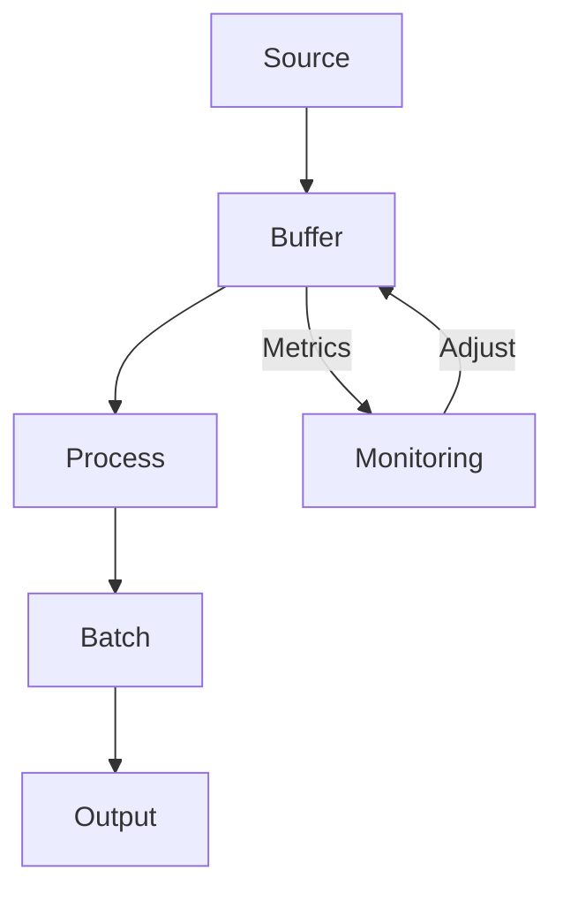

# Streaming Performance Optimization



## Core Optimization Techniques

### 1. Batching Strategies
```csharp
// Optimal batch size (100-1000 items typically)
await foreach (var batch in _mediator.CreateStream(request)
    .Buffer(500)
    .WithCancellation(cancellationToken))
{
    await ProcessBatch(batch);
}
```

### 2. Parallel Processing
```csharp
services.AddFSMediator(cfg => 
{
    cfg.AddStreamingPipeline(options => 
    {
        options.MaxDegreeOfParallelism = Environment.ProcessorCount;
        options.BufferCapacity = 1000;
    });
});
```

## Performance Checklist

| Area | Optimization | Impact |
|------|--------------|--------|
| Memory | Limit buffer sizes | Prevents OOM |
| CPU | Parallel processing | Higher throughput |
| IO | Batch operations | Reduced overhead |
| Network | Compression | Lower latency |

## Monitoring & Tuning

Key Metrics to Watch:
- `mediator_stream_throughput` (items/sec)
- `mediator_stream_latency` (ms)
- `mediator_stream_buffer_usage` (%)

See [Metrics Setup](../monitoring/metrics.md) for configuration.

## Common Pitfalls

1. **Unbounded Buffers**
   - Symptoms: Memory growth, GC pressure
   - Fix: Set reasonable buffer limits

2. **Blocking in Handlers**
   - Symptoms: Low throughput, thread starvation
   - Fix: Use async I/O, avoid sync over async

3. **Over-Parallelization**
   - Symptoms: High CPU, contention
   - Fix: Match parallelism to CPU cores

## Advanced Techniques

### Memory Optimization
```csharp
// Use ArrayPool for large buffers
var buffer = ArrayPool<byte>.Shared.Rent(1024);
try { /* process */ }
finally { ArrayPool<byte>.Shared.Return(buffer); }
```

### Efficient Serialization
```csharp
services.AddFSMediator(cfg => 
{
    cfg.ConfigureSerialization(options => 
    {
        options.UseMemoryPack(); // High-perf binary serializer
    });
});
```

## Next Steps

- [Review Streaming Basics](../streaming/basic-streaming.md)
- [Explore Advanced Patterns](../streaming/advanced-streaming.md)
- [Monitor Performance](../monitoring/metrics.md)